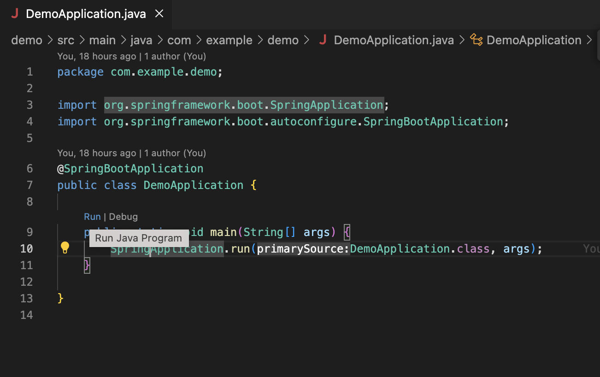

# 参考教材

- [手を動かしながら学ぶ！Spring Boot 入門](https://www.techpit.jp/courses/224)

# 発展教材

- [実践 SpringBoot ~SpringBoot Advanced Tutorial~](https://www.techpit.jp/courses/232)
  ※未着手。必要に応じて。

# サーバー起動

http://localhost:8080 でみる

VSCode の拡張機能で、demo/src/main/java/com/example/demo/DemoApplication.java  
の main 関数を Run する。  


# 依存関係のビルド

`pom.xml`でコード内を右クリックして、`Add Starters`から必要な依存関係を追加する。  
その後`Proceed`をクリック。

# 標準出力

```java
@PostMapping("/create")
public String create(@Validated @ModelAttribute Person person, BindingResult result, Model model) {

    // 標準出力
    System.out.println(result);
    System.out.println(person.getAge());

    if (result.hasErrors()) {
        model.addAttribute("people", repository.findAll());
        return "person/index";
    }
    repository.saveAndFlush(person);
    return "redirect:/";
}
```

このようにログ出力できる。

# H2 データベースについて

sqlite ではなく Java ではこちらが一般的な簡易 DB。

# maven

maven を利用して setup している。

# CRUD

## CREATE

## READ

## UPDATE

## DELETE

# Rails との比較

Rails 近い思想、構成になっている。

- ルーティングは controller のみで設定する
- バリデーションや DB 周りは model で行う
- view は html ファイルに spring boot の構文が使える。ループして全部表示するものは each で回すのが基本。
- Gemfile のように pom.xml に依存関係を追加する
- terminal にエラーが出る
- log level を設定すると Rails 同様の粒度でアプリケーションエラーが表示される
